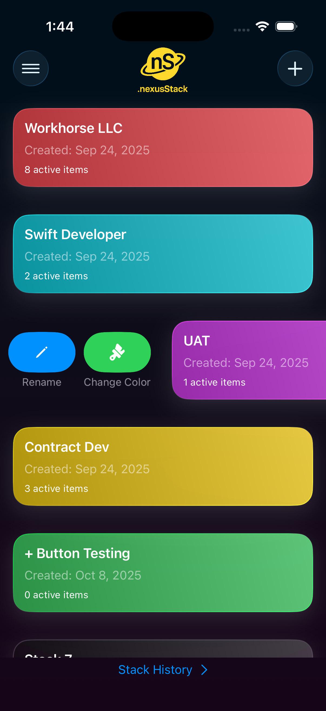
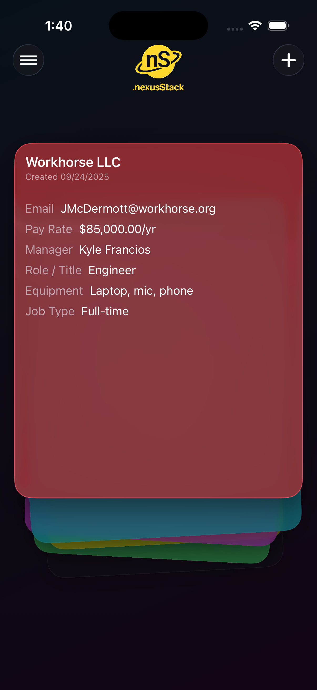
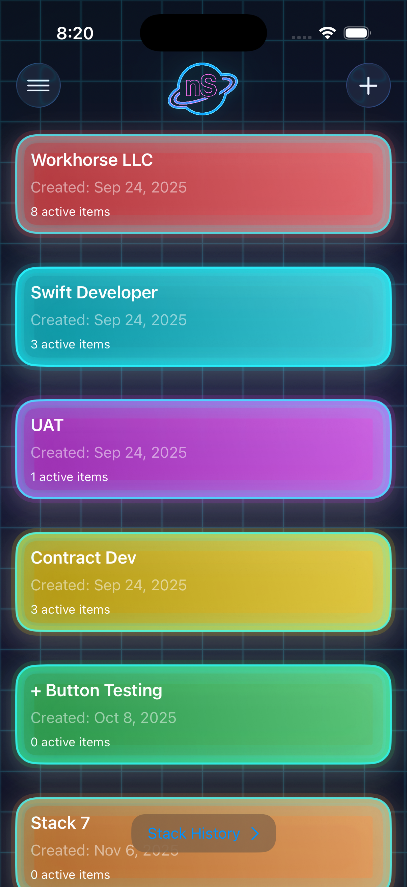
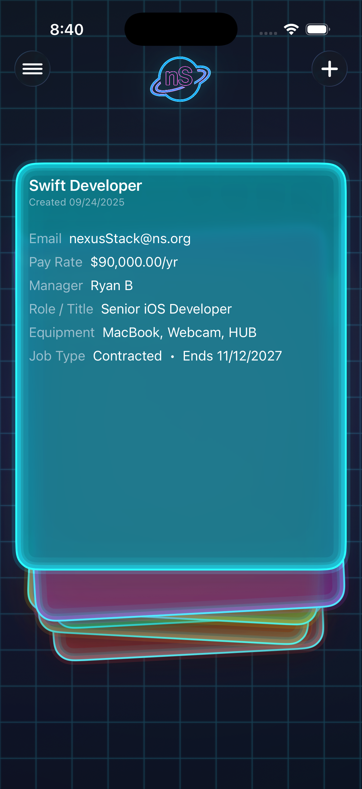
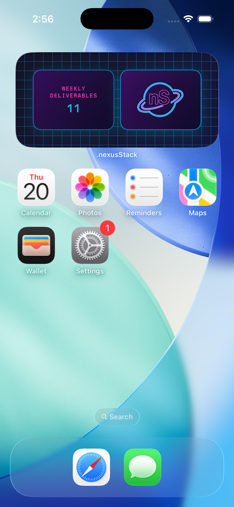

nexusStack - Productivity Task Manager

| Home View | True Stack Deck View (TSDV)|
|:---------:|:------------:|
|  |  |

| Home View (Midnight Neon)| TSDV (Midnight Neon) |
|:---------:|:------------:|
|  |  |

| Liquid Glass  | Weekly Deliverables Widget |
|:---------:|:------------:|
|  |  |

<!--
-->

nexusStack is a sleek productivity app designed to simplify task and project management. Built for iOS, it helps users create and organize jobs with deliverables, checklists, notes, and due dates. The app offers customizable task colors, reminder notifications, and options to mark tasks as complete or delete them, all within an intuitive interface featuring tabs for due tasks, checklists, notes, and job details.

Features

    Job Management: Create and manage jobs with associated tasks.
    Deliverables: Add tasks with due dates and customizable colors.
    Checklists: Organize subtasks within jobs.
    Notes: Attach notes to jobs for additional context.
    Reminders: Set notifications for due dates.
    Task Actions: Mark complete, delete, or change colors via swipe gestures.
    User-Friendly Interface: Navigate easily with dedicated tabs.

Installation

    Clone the repository: git clone https://github.com/ColdCodeBliss/nexusStack.git
    Open the project in Xcode.
    Ensure you have Xcode 18.4 or later installed.
    Build and run on an iPhone simulator (e.g., iPhone 17).

Usage

    Launch the app to access the HomeView.
    Add a job (e.g., "Job 1") and navigate to its "Due" tab.
    Create deliverables, set due dates, and configure reminders or colors.
    Use swipe actions to manage tasks efficiently.

Requirements

    iOS 18.0 or higher
    Xcode 18.4
    Swift 5

Contributing

Contributions are welcome! Please fork the repository and submit pull requests for review.
License

MIT License - Feel free to modify and distribute, but include the original license.
Contact

For questions, reach out at ColdCodeBliss@gmail.com.

Note: This project is under active development. Expect updates and additional features soon!
